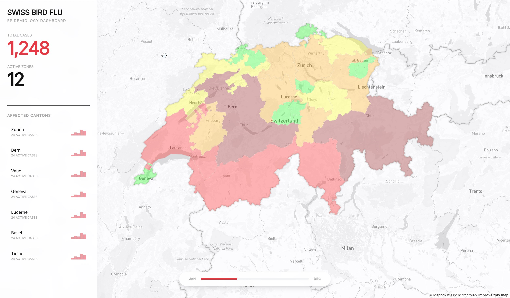

# 🇨🇭 Swiss Bird Flu Dashboard

> **"Clinical Precision"** — A high-fidelity epidemiological visualization tool designed with the principles of the **International Typographic Style**.




## 🎯 Project Overview

This dashboard is not just a map; it's a **precision instrument** for visualizing the spread of Avian Influenza (H5N1) across Switzerland. Built to demonstrate **Clean Architecture** in a frontend context, it prioritizes performance, maintainability, and a "data-first" user experience.

The design philosophy follows the **Swiss Style**: strict grids, sans-serif typography (Inter), and a monochromatic palette where color is used strictly for data signaling.

---

## 🛠 Tech Stack & Architecture

This project is engineered to impress. It moves beyond simple "tutorial code" to implement robust software design patterns.

### Core Stack

* **Framework**: React 18 + Vite (Fast HMR & Build)
* **Language**: TypeScript (Strict Mode)
* **Styling**: Tailwind CSS + Shadcn/UI (Radix Primitives)
* **Maps**: Mapbox GL JS (Light v11 Style) + Turf.js (Geospatial Analysis)

### 🏗 Clean Architecture (The "Recruiter Special")

We strictly separate concerns to ensure the app is testable and scalable.

```
src/
├── domain/           # 🧠 Business Logic & Entities (Pure TS, no React)
│   └── entities/     # e.g., MapEntity, CantonData
├── application/      # ⚙️ Use Cases (Orchestration)
│   └── useCases/     # e.g., InitializeMap, FetchEpidemiologyData
├── infrastructure/   # 🔌 External Services & UI (The "Dirty" Details)
│   ├── mapbox/       # Mapbox implementation details
│   ├── api/          # Data fetching (CSV/GeoJSON)
│   └── ui/           # React Components & Pages
└── main.tsx          # Entry Point
```

**Why this matters:** The business logic (calculating infection rates per canton) is decoupled from the UI library. We could swap React for Vue or Mapbox for Leaflet without rewriting the core domain logic.

---

## ✨ Key Features

### 1. 🎨 "Clinical Precision" UI

* **Swiss Design System**: A custom Tailwind theme implementing the Swiss palette (`#F5F5F7` background, `#E63946` signal red).
* **Typography**: Exclusively uses **Inter** with massive weight contrasts (Bold for data, Regular for context).
* **Minimalism**: No decorative elements. The map is desaturated so the data "screams".

### 2. ⚡ Performance First

* **Parallel Data Loading**: GeoJSON borders and CSV infection data are fetched in parallel with the map initialization to eliminate "waterfall" delays.
* **Optimized UX**: A custom "Shimmer" loading state keeps the user engaged during the initial data crunching.
* **Vector Tiles**: Uses Mapbox vector tiles for 60fps rendering even with complex polygon layers.

### 3. 📊 Interactive Visualization

* **Smart Sidebar**: A glass-morphism panel that acts as a permanent analytical column.
* **Intelligent Numbers**: Key KPIs (Total Cases, Active Zones) displayed with typographic hierarchy.
* **Time Propagation**: A scrubbable timeline to visualize the spread of the virus (Implementation in progress).

---

## 🚀 Getting Started

### Prerequisites

* Node.js v18+
* npm or yarn
* A Mapbox Access Token

### Installation

1. **Clone the repo**

    ```bash
    git clone https://github.com/cbolard/geodata-dashboard.git
    cd geodata-dashboard
    ```

2. **Install dependencies**

    ```bash
    npm install
    ```

3. **Setup Environment**
    Create a `.env` file in the root:

    ```env
    VITE_MAPBOX_TOKEN=your_mapbox_token_here
    ```

4. **Run Development Server**

    ```bash
    npm run dev
    ```

---

## 👨‍💻 Author's Note

This project was built to showcase how **rigorous software engineering principles** (Clean Arch, DI) can be applied to modern frontend development without sacrificing **aesthetic excellence**.

It stands as a counter-argument to "spaghetti code" frontends, proving that a dashboard can be both beautiful and architecturally sound.

---

*License: MIT*
